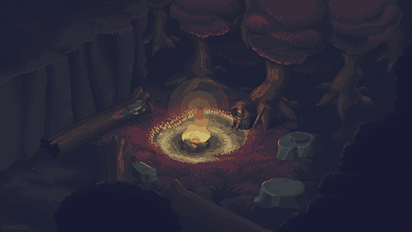

<h1 align="center"> ☁️ Hello there! I'm Kevin ☁️ </h1>
 

`uWaterloo CS Student 💻`

<h3 align="left"> <b> About Me:</b> </h3>

- 👨‍💻 Current SWE Intern @ Qualifacts, ML Researcher @ Vision and Image Processing Labs (uWaterloo)
- 🌼 Previously @ Dandelion Networks, Evertz Microsystems
- 🥞 Tech Stack:
  - **Languages:** C/C++, Python, Golang, JavaScript, TypeScript, SQL, Java, Bash
  - **Tools:** React, Node.js, scikit-learn, TensorFlow, PyTorch, Docker, Git, Jenkins, AWS, PostgreSQL, MongoDB
- 🌱 When I'm not coding, I enjoy rock climbing and playing video games!
- 🚀 Let's Connect! ~ <kx3tan@uwaterloo.ca> ~ [/in/kevin-x-tan/](https://www.linkedin.com/in/kevin-x-tan)
